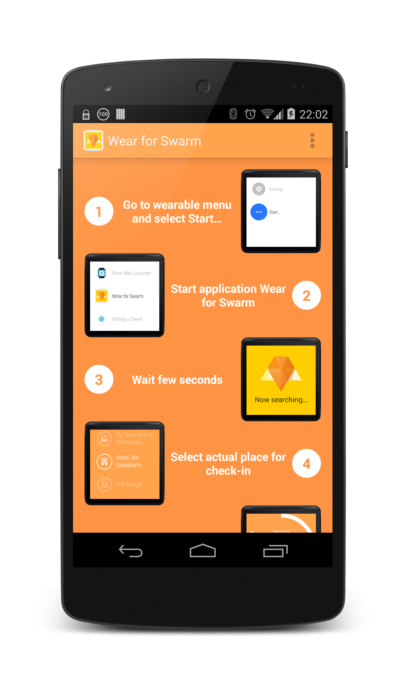
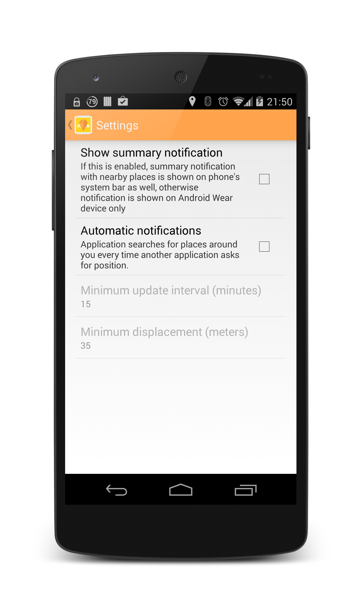
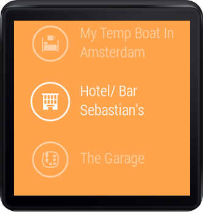
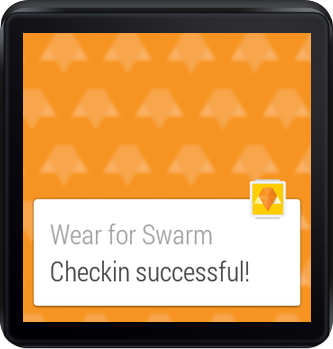

# Wear for Swarm
Swarm (aka Foursquare) for Android Wear!

## Features

- List nearby Foursquare places
- Make a checkin on selected place
- Stay notified about nearby places available for check-in

## Details

With Wear for Swarm you can search for nearby Foursquare places and make a check-in directly from your Android Wear device.

With "Automatic notifications" you can be notified about places around you every time another application asks for position (it uses  passive location provider only - no additional battery consumption) in minimal interval 15 minutes and minimum displacement 35 meters. This feature must be enabled in "Settings".

## Download

[](https://play.google.com/store/apps/details?id=io.seal.swarmwear) 

## Images








## Setup
In project home folder create file `gradle.properties` and set Foursquare Client ID and Client Secret (replace stars). You can get them [here](https://foursquare.com/developers/apps).

```
# Foursquare Client ID and Secret (mandatory)
foursquareClientId=******************
foursquareClientSecret=******************

```

## Build
```
./gradlew assembleDebug
```

## Lint clean
```
./gradlew lintClean
```

## Optional Setup
In `gradle.properties` add following properties (replace stars)

```
# Crittercism App ID (optional)
crittercismAppId=******************
gaPropertyId=******************

# Release keystore properties (required for release build only) 
signingStoreLocation=******************
signingStorePassword=******************
signingKeyAlias=******************
signingKeyPassword=******************
```
 
## Follow me on
Author: Ondřej Kroupa

<a href="http://plus.google.com/108537092739142658885/">
  
</a>
<a href="http://cz.linkedin.com/in/sealskej/">
  
</a>

## Thanks to:

Mario Viviani - http://github.com/Mariuxtheone

David Vávra - http://github.com/destil

## License

Teleport is released under the **Apache License 2.0**

    Copyright 2014-2015 Ondřej Kroupa
    
        Licensed under the Apache License, Version 2.0 (the "License");
        you may not use this file except in compliance with the License.
        You may obtain a copy of the License at
    
           http://www.apache.org/licenses/LICENSE-2.0
    
        Unless required by applicable law or agreed to in writing, software
        distributed under the License is distributed on an "AS IS" BASIS,
        WITHOUT WARRANTIES OR CONDITIONS OF ANY KIND, either express or implied.
        See the License for the specific language governing permissions and
        limitations under the License.

